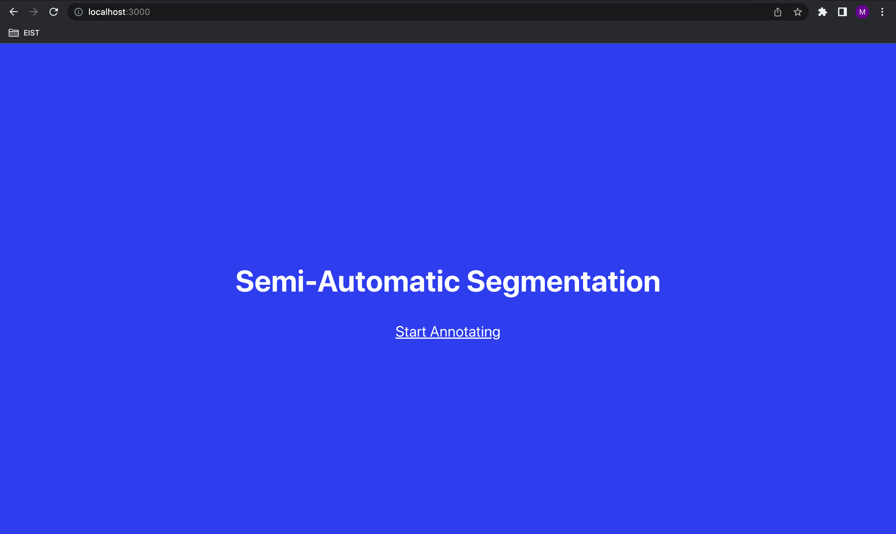
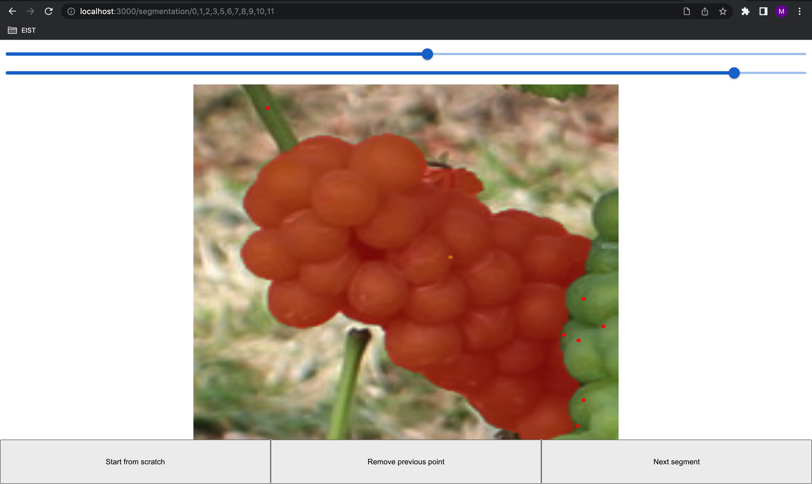

# A Semi-Automatic Segmentation Tool

The tool in its current state works on grape bunch instance segmentation. It suggests masks and lets the user refine it via the iterative click-based method FocalClick.

## Installation
- Clone the repo.
- Get Node.js and npm from https://nodejs.org/en/download/releases/. This project uses v14.20.1. To do this from the command line, run the following commands:
    - `sudo apt-get update` 
    - `sudo apt-get install build-essential libssl-dev`
    - get and execute the nvm installation script with `curl -o- https://raw.githubusercontent.com/nvm-sh/nvm/v0.35.3/install.sh | bash`
    - `source ~/.nvm/nvm.sh`
    - this finally installs npm and Node.js v14.20.1: `nvm install v14.20.1`
- Execute `pip install -r requirements.txt` in the root folder to get the requirements for the back end listed in **requirements.txt**. However, detectron2, which is necessary for the Mask R-CNN cannot be installed like this. Therefore, run `git clone https://github.com/facebookresearch/detectron2.git` and `python -m pip install -e detectron2` in the root folder.
- Run `npm install` to install all requirements for the frontend defined in package.json.
- Download the models that are required
    - Download the segformer model for FocalClick from [here](https://drive.google.com/file/d/1DkFun_tiw7z7RpjDtwqV65k1e9jxnLkr/view?usp=share_link), place it in [Back-End/FocalClick/models/focalclick](./Back-End/FocalClick/models/focalclick), and name it **segformerB3_S2_comb.pth**. Alternatively, from the root of the repo, just run `gdown https://drive.google.com/uc?id=1DkFun_tiw7z7RpjDtwqV65k1e9jxnLkr -O ./Back-End/FocalClick/models/focalclick/segformerB3_S2_comb.pth`
    - Download the Mask R-CNN from [here](https://www.dropbox.com/s/cxha1jozl544bmj/model_RGB.pth?dl=0) and place it in [Back-End/Mask-RCNN](./Back-End/Mask-RCNN). The file has to be be named **model_RGB.pth**. This can also be done by simply running `wget -O ./Back-End/Mask-RCNN/model_RGB.pth "https://www.dropbox.com/s/cxha1jozl544bmj/model_RGB.pth?dl=1"` from the root of the repo.

## Running the application in the Chrome browser

### Starting the back end
Navigate to the [API folder](./Back-End/API) and run `uvicorn main:app --reload`.

### Starting the front end
Run `npm start` in the [front end folder](./Front-End). This command will start the front end of the application. Then open [http://localhost:3000](http://localhost:3000) to view it in your browser.

### Running the tool on a server
Note that the React front end will run on port 3000 and the python back end will run on port 8000 by default. In case the tool does not run on the local machine but on a server, one option is to use port forwarding. Instead of connecting via `ssh user@server-address`, use `ssh -L 3000:localhost:3000 -L 8000:localhost:8000 user@server-address`.
In case you want to run front end and back end in the same docker container, it is necessary to publish those ports as well, so make sure to include `-p 3000:3000 -p 8000:8000` when starting the container. Moreover, instead of running `uvicorn main:app --reload`, use `uvicorn main:app --reload --host 0.0.0.0`.

## User manual
### Annotation process
1) Start the annotation process.

2) Press "Load Image(s)" and pick one or more images you want to annotate.
3) The images are loaded and bounding box suggestions are being prepared.

4) After the loading process is done, the suggested bounding boxes (if there are any) are displayed. You can now
    - draw new bounding boxes by placing a left click, drawing the box, and placing another left click to finish the annotation.
    - edit bounding boxes by hovering over a bounding box and placing a right click. An editor menu will open, where you can either delete, move, or rescale the box. When moving the box, the box will lock in place upon the next left click. For rescaling a box, click on one of the four highlighted corners to adjust and click left again to finish the rescaling.
5) When the bounding boxes are satisfactory, you can continue to segmentation by pressing "Continue to segmentation". Each bounding box content will be displayed and can be segmented. If a suggested bounding box was correct and in no way altered, there is also going to be a mask suggestion displayed. Note the two bars on top of the image: with the upper one you can control the brightness of the image, the lower one regulates the opacity of the mask. To edit the mask, place positive clicks with left clicks and negative clicks with right clicks. When starting without a mask suggestion it is recommended to start by placing a positive click in the middle of the desired object. When starting from an existing mask, simply add positive clicks where mask is missing and add negative clicks where mask is too much. The buttons on the bottom allow to either start from scratch, roll back the previous click, or move on to the next bounding box to be segmented.

6) When all segmentations are done for one image and several images were chosen in the beginning, the tool will return to 4).
7) When all segmentations are done for all images, the annotations can be saved in a desired format (currently only COCO supported). Moreover, a separate window will open, visualizing the annotations.

### Visualizing the annotations at a later point in time
If you want to visualize annotations in a COCO-formated JSON file at a later point in time, you can use the script **visualization.py** in the [evaluation folder](./Eval_scripts). However, there is a catch. Sometimes, the JSON file refers to the image names, without giving a path where to find them (Option A), sometimes there is a relative path given (Option B). Our tool for example can only write the image name to the JSON file because your local images are uploaded to the browser; for privacy reasons, browsers are never provided with local system paths, only filenames. The script can be used for both options.
- If Option A applies to your JSON file (only filenames), run **visualization.py** from the command line with two arguments: the path to the JSON file, then the path the folder where to find the images.
- If Option B applies to your JSON file (filenames are given as relative paths) **and the JSON file is actually positioned like this relative to the images**, it is sufficient to run **visualization.py** from the command line passing only the path to the JSON file.

### Comment on visualization with FiftyOne
There seems to be a bug that some images do not get rendered. Apparently, it does not work with .jpg files larger than 1 MB. You can follow the issue on Github [here](https://github.com/voxel51/fiftyone/issues/1750).

### Evaluating annnotations against a ground truth
TODO: this is not final yet
To evaluate one or more COCO-formated annotations against a ground truth file, run **evaluation.py** from the [evaluation folder](./Eval_scripts) on your command line, simply passing the path to the ground truth JSON file, then passing the path(s) to your annotation(s).